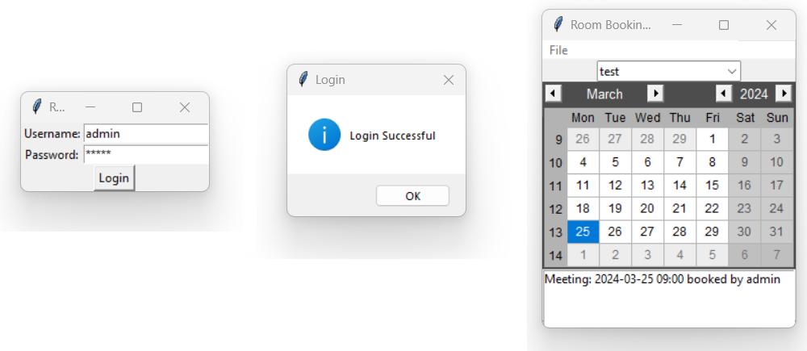

# Room Booking Desktop Application

## Python Version:


## Tkinter Version:
8.6

## Overview
The Room Booking Desktop Application is a simple yet powerful tool for managing room bookings and meetings. Built using Python and the tkinter library for the graphical user interface (GUI), this application allows users to create, view, and manage meetings across different rooms.

## Features
- **User Authentication**: Secure login system to authenticate users before accessing the application.
- **Room Management**: Create and manage rooms available for booking.
- **Meeting Creation**: Schedule meetings by selecting a room, date, and time.
- **Meeting Display**: View scheduled meetings for selected rooms and dates.
- **Intuitive GUI**: User-friendly interface for easy navigation and interaction.

## Prerequisites
- Python 3.x installed on your system.
- Required Python packages:
    - tkinter
    - tkcalendar
    - sqlite3

## Installation
1. Clone the repository to your local machine:
    ```
    git clone https://github.com/afiay/RoomBookingDesktop
    ```

2. Navigate to the project directory:
    ```
    cd RoomBookingDesktop
    ```

3. Install the required Python packages:
    ```
    pip install -r requirements.txt
    ```

## Usage
1. Run the application by executing the following command:
    ```
    python main.py
    ```

2. Upon launching, the login screen will appear. Use the default credentials (username: admin, password: admin) or create a new user account.

3. Once logged in, you can create rooms, schedule meetings, and view existing bookings.

## Screenshot


## Contributing
Contributions are welcome! If you find any issues or have suggestions for improvements, please open an issue or submit a pull request.

## License
This project is licensed under the [MIT License](LICENSE).